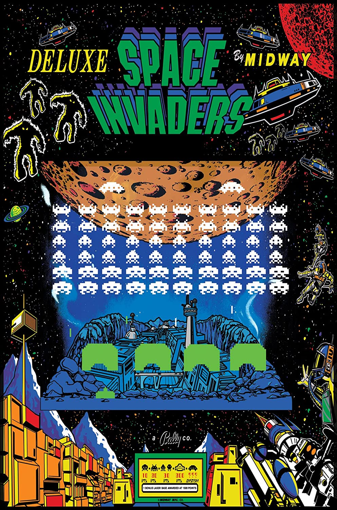

# Space Invaders
* author: Gian Luis Bolivar Diana
* email: _gianluisbolivar1@gmail.com_

## How to play
* **Left arrow key** - Move the spaceship to the left
* **Right arrow key** - Move the spaceship to the right
* **Space bar** - Shoots

## Directroy Structure
```
  .
  ├── audio          # The audio played in the game
  ├── src            # Game implementation
  ├── fonts          # The fonts used to display text
  └── images         # All the images that will be drawed
```

## References:
* [PyGame documentation](https://www.pygame.org/docs/)
* [Tutorial based](https://github.com/clear-code-projects/Space-invaders)
* [Github repository](https://github.com/gianluisdiana/SpaceInvaders)